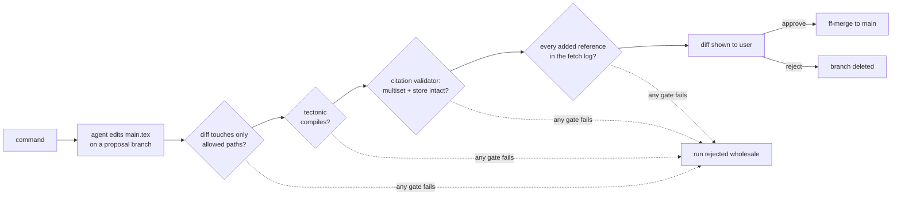

# The agent

How peer review and natural-language editing work under the hood — and why the agent does its work inside a sandbox instead of behind an API.

## The sandbox thesis

LLM agents are unreliable exactly where systems usually put them: free-form output, novel interfaces, state they have to remember. They are strikingly reliable in the opposite setting — familiar tools, one working directory, and hard formats their output must land in. That setting is what this system builds.

A **papercli repo** is that sandbox. It has one root with a fixed layout, so the agent never has to discover or invent structure — `main.tex` is always the paper, `refs.json` is always the references, `reviews/N/` is always where findings go. Its state model is git — the single tool coding agents are most fluent in, so "work on a branch, show a diff, merge or drop it" needs no bespoke protocol, no custom undo, no state machine. And every output that matters lands in a well-defined structure that deterministic code validates and consumes:

| The agent produces | Format | Validated by | Consumed by |
| --- | --- | --- | --- |
| edits to the paper | a git diff on a proposal branch | path allowlist + tectonic compile + citation validator | ff-merge on approval |
| review findings | `reviews/N/review.xml` | RelaxNG schema + source-id fetch log | XML → `review.tex`, citeproc bibliography, frontend JSON |
| references to cite | CSL-JSON records in `refs.json` | hallubib resolution against OpenAlex / S2 / Crossref / arXiv | citeproc rendering, `refs.bib` generation |
| reconstruction (ingest) | `main.tex` + `refs.bib` | tectonic + structural bib gate + paritex parity | the repo itself, after human acceptance |

The division is deliberate: the agent is *free* where free-form is its native strength — writing LaTeX prose is text completion — and *structurally constrained* everywhere a contract must hold. Correctness is never requested in a prompt when it can be enforced by a validator. A made-up source id is not "discouraged"; it fails schema validation. A dropped citation is not "against the rules"; it fails the multiset diff and the run is rejected wholesale.

This is also why the end state of the design is small: a sandbox repo, a set of skills, and any capable agent dropped into it. The harness does not grow with the agent's capabilities — a better model in the same sandbox just writes better LaTeX and better-grounded findings, and the same gates hold it to the same contracts.

## Code executes, the agent judges

Deterministic work — parsing, hallubib resolution, parity, citeproc rendering, tectonic builds, validation — is plain functions that run and commit their results. The agent is reserved for judgment: extracting claims, weighing claim–source support, deciding what a review should say, rewriting text. Skills the agent calls are thin wrappers over those same functions: one implementation, two callers (CLI verb and skill).

All LLM invocations go through one runner module — headless `claude -p` today, the Claude Agent SDK as a drop-in — selected and parameterized by the config's `[agent]` table, which reuses paritex's backend-spec schema so there is exactly one AI-invocation config shape in the system. Nothing outside the runner knows which backend runs.

### Choosing the backend, and who pays for it

A backend is a configured command (paritex's `Backend` spec: `argv`, `mode`, prompt templates, `timeout`, and the env controls `env`/`drop_env`/`require_env`). Two Claude flavors are built in, and the difference between them is authentication — made explicit in the spec because inherited auth is how API bills happen by accident:

| Backend | Auth | Behavior |
| --- | --- | --- |
| `claude-code` (default) | the box's Claude Code login | `ANTHROPIC_API_KEY` / `ANTHROPIC_AUTH_TOKEN` are scrubbed from the child environment, so an exported key can never silently outrank the login and bill the API account |
| `claude-api` | `ANTHROPIC_API_KEY` | refuses to start if the key is unset; spending API credits is a choice of backend, never a side effect of the shell |

Selection is layered like everything else: the built-in default, then `[agent] backend = "..."` in the user config or the repo's `[tool.papercli]`, then the `PAPERCLI_AGENT_BACKEND` env var for a one-shot switch. Any other agent CLI slots in as a custom backend — same spec, no code changes:

```toml
[agent]
backend = "claude-code"            # or "claude-api", or a name defined below

[agent.backends.codex]
argv = ["codex", "exec", "--full-auto", "{prompt}"]
require_env = ["OPENAI_API_KEY"]   # fail loudly before spawning, not after

[reconstruct]
backend = "claude-code"            # the PDF-reconstruction run, same spec
model = "sonnet"                   # reconstruction is transcription: fast model + parity gate
effort = "medium"                  # beats a slow model; both overridable per run in UI and CLI
rounds = 1                         # one automatic pass; further passes are the user's call (refine)
```

paritex documents the full spec (it owns it); papercli's builtins differ only in extending `--allowedTools` with `Bash(papercli:*)` so the sandbox skills are callable, via the same `claude_backend()` factory. `model`/`effort` under `[agent]` and `[reconstruct]` map to the claude builtins' `--model`/`--effort` flags — `[agent]` defaults to the box's Claude Code settings, `[reconstruct]` to sonnet/medium — and are ignored by custom backends, whose argv is their own.

A run executes *inside* the repo: `claude -p` with the sandbox as its working directory, on a proposal branch, with the skills and permission settings materialized into `.claude/` from papercli package data immediately before the run. The toolbox is papercli-versioned, not paper-versioned — `.claude/` is gitignored inside the repo and regenerated every time, so upgrading papercli upgrades every paper's toolbox at once.

Each run type has one small prompt that names the contract to satisfy — "review this paper into `reviews/N/review.xml`, every finding sourced via the search skill" — and the capability lives in the skills, not in prompt bulk. There is no giant do-everything prompt to drift.

The whole system stays CLI-first: `papercli review`, `papercli do "make the intro shorter"`, `papercli approve`. The web app is a thin adapter over the same core functions, reading the same committed state.

## Peer review, anatomically

`papercli review` prepares `reviews/N/`, materializes the toolbox, and starts an agent run whose contract is the review XML. Inside the sandbox the agent:

1. **Reads the paper** — `main.tex`, directly; it is text, and reading it is what the model is for.
2. **Extracts claims** per section and decides what to check: which citations carry load-bearing claims, which topics the paper should have engaged.
3. **Searches** via the search skill — `papercli search "<query>"` hits Semantic Scholar and OpenAlex through hallubib's clients and prints real records. Crucially, the skill also appends every record it returned, verbatim, to the run's `sources.json` fetch log. The agent cannot cite a source the log has not seen, because validation checks every id against it.
4. **Checks support** — for existing citations, the abstracts skill fetches the cited works' abstracts from the store's resolved records; the agent judges claim against abstract — supported, partial, unsupported — and must state a confidence.
5. **Writes findings** to `reviews/N/review.xml` in the required schema.

Then code takes over. The XML is validated against the RelaxNG schema shipped as papercli package data — the schema *requires* every finding to carry a `<source>` element, so an ungrounded finding is unrepresentable, and every source id must appear in the fetch log or the existing store, so a hallucinated one is unwritable. Referenced new sources are resolved through hallubib into the shared CSL-JSON store. `review.tex` and its citeproc bibliography are generated from the XML, tectonic builds the reviewer-style PDF, and the run is committed and tagged `review/N`. The frontend reads the same XML as derived JSON, each finding linked to its source.

Because review sources are already resolved into the store, acting on a finding is cheap: "add this citation" inserts a `\cite` of a key that already exists.

## Natural-language editing, anatomically

`papercli do "tighten the methods section"` creates a proposal branch and runs the agent in the sandbox with the command and one contract: improve `main.tex`, cite only keys that exist in the store, use the search skill first if the edit needs new sources.

The agent edits the LaTeX directly. There is no typed-operation planner between the command and the file — an earlier design had one, and it was superseded on purpose. Emitting `tighten_section("methods", 0.8)` for code to execute moves the hard judgment (what to cut, how to rephrase) into the weakest link, the operation vocabulary, while the model's actual strength is exactly the freeform rewrite. The constraint belongs on the *output*, where it can be checked, not on the input, where it can only be requested:



After the run, code enforces the contract: the diff may touch only `main.tex` and the store-derived files; tectonic must recompile it; the citation validator must pass. A run that violates any gate is rejected in full — no partial application, no salvage.

The store is one of those writable paths, so grounding has to be checked here too rather than assumed from the skill being used: any entry the run *added* to `refs.json` must carry a source id that appears in the run's own fetch log. `papercli addref` is the path that satisfies this by construction; a reference written straight into the store, however plausible, fails the gate. This is the edit-side counterpart of the review's source-id check — the same rule, at the other end of the sandbox. A run that passes is committed on the branch by the harness (the agent never commits), and the user sees the git diff. Approve is a server-side fast-forward merge; reject deletes the branch. The agent never touches main and never rewrites history.

One run per repo, guarded by a lock file in the repo — the CLI and the server are separate processes respecting the same lock, and a busy repo surfaces as exactly that in the UI. Approving and rejecting take the same lock, because both check out `main` and a run in flight is sitting on the proposal branch; the UI disabling those buttons is a courtesy, not the guarantee.

### The path no allowlist can express

A diff gate can only see what git reports, and git never reports `.git/` as dirty — so the sandbox's own metadata is the one place an agent could write that the path allowlist is blind to. That would be uninteresting if git config were inert, but several keys name commands git runs *on the harness's behalf*: `diff.external` on `git diff`, `core.fsmonitor` on `git status`, `core.hooksPath` on `git commit`, a `filter.*.clean` driver on `git add`. A repo-local config is therefore an execution primitive pointed at the process holding the gates, which is the exact inversion this design exists to prevent.

Two defences, chosen so neither depends on a rule being remembered at a call site. The git-store module states the dangerous settings on every single command line it builds, where they outrank anything in a config file. And every agent run — edit, review, and the reconstruction pass at ingest — is wrapped so that `.git/config` is captured before and compared after: a changed config is restored from the captured bytes and the run is rejected, before the rollback path itself runs another git command. The first defence covers the keys that are known; the second covers the class.

## Calling Semantic Scholar and OpenAlex

hallubib's source clients (OpenAlex, Semantic Scholar, Crossref, arXiv) are the only HTTP layer — one boundary, with caching, per-host pacing and polite-pool identification from config. Every id, DOI and title shown to the user is verbatim from an API response; ids are never synthesized, and the fetch log makes that checkable after the fact rather than assumed. Empty searches, low-confidence matches and network failures are surfaced as exactly that — a down source is distinguishable from "not found online".

## Citations intact across edits

- The anchor is the `\cite{key}` itself: text can move, shrink or merge and the marker travels with it.
- The validator diffs the cite-key multiset and the CSL-JSON store before and after every change; a commit that would drop a key or a reference entry is refused. Every path an agent can write through is gated before anything is committed, each with the rule that fits it: an edit run may touch `main.tex` and the store-derived files and must survive the multiset check; a review run may touch nothing outside its own `reviews/N/` directory, which is how "a review never edits the paper" stops being a line in a prompt and becomes a property of the system. Adding a reference is the harness's job either way — from the run's fetch log, never from the agent writing `refs.json` itself.
- New text may only cite keys that exist in the store, and keys only enter the store through hallubib resolution — so every inserted citation was verified online before it became citable.
- Review XML cites are elements (`<cite key="..."/>`), so review documents pass the same multiset check as the paper.
