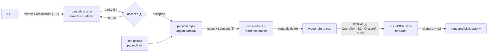

# Citation parsing

How an uploaded paper becomes normalized, CSL-JSON citations — and why the PDF is read exactly once.

## Read the PDF once

I have tried a lot of PDF parsing over the years: layout heuristics, ML segmenters, regex over text dumps, commercial extractors. Nothing came close to what a recent LLM does with a paper. It is the first approach that gets a table caption, a footnote marker and an author–year citation reasonably right. It is also expensive, non-deterministic, and still wrong often enough to matter: a PDF is a rendering, and a model reading a rendering is a model reading an image, which is the six-finger case from the [README](../README.md).

The model gets one shot at saying what the document is, and that answer is immediately cast into a representation that is cheap to read, precise to edit and mechanically checkable - the **papercli repo**.

This means **cost/risk is incurred once per paper improvement project**, not once per operation. This first step is hard and error-prone, but it can be inspected, scored and re-run in isolation, instead of being smeared thinly across every later call.

The honest word for what the model produces is a **guess**. A paper's source is not recoverable from its rendering and systems that pretend otherwise are where users' trust goes to die. What ingest produces is a hypothesis about the document, plus some evidence for how good it is.

## A guess needs a verdict

Two of them: one machine, one human.

**The machine verdict is parity.** tectonic compiles the reconstruction, [paritex](https://github.com/endremborza/paritex) aligns the rebuilt PDF word-level against the original and scores the divergence. Structural gates run alongside: a round whose `refs.bib` is missing, empty, or short of the keys the text cites is rejected outright — a bibliography-less reconstruction cannot pass, whatever its word ratio. The final report (ratio plus every diverging block) is committed as `report.json`. Reconstruction loss is measured up front, not discovered at export.

**The human verdict is acceptance.** The reconstruction is presented rather than assumed: the rebuilt PDF next to the original, the divergences that remain, and the citation list that was extracted - *this is what your paper looks like when we render it from our idea of what it is*. The user accepts, and the repo is created, or the user asks for a re-run, and reconstruction starts over — another backend, more rounds, a larger budget - producing a fresh candidate. The original PDF is committed to the repo.

Acceptance is the one moment a human is asked to validate a machine's claim about *what the paper is*. Every question after it is about a proposed change, with a diff, on a branch. That is the real payoff of paying the parsing cost up front: an open-ended, recurring accuracy problem collapses into a single reviewed decision, after which the project runs on two guarantees instead of a probability - git for persistence, [hallubib](https://pypi.org/project/hallubib/) for reference correctness. It would probably worth it to allow the user to slightly correct / edit the .tex directly, but that is out of scope for now.

A paper that arrives as source (`.tex` upload, or `papercli init` on an existing directory) skips all of this — there is no guess to verify.

## Pipeline steps

1. **Extract.** pymupdf pulls text, layout and raster images from the PDF (paritex).
2. **Reconstruct.** An AI backend writes `main.tex` + `refs.bib` into the papercli repo layout; tectonic must compile it, and the structural bibliography gate must pass.
3. **Parity.** Word-level alignment against the original scores the round and names the diverging blocks; those feed further rounds until parity converges or plateaus. The report is committed.
4. **Accept** (user). The candidate is shown — rebuilt PDF, divergences, extracted citations — and either accepted, which tags the repo to be initiated and unlocks everything downstream, or sent back for a re-run.
5. **Locate and segment.** In-text markers are the `\cite` commands (balanced-brace parsing, all `\cite*` variants); the reference list is `refs.bib`, where segmentation into entries comes free from BibTeX structure. Source uploads using inline `thebibliography` go through hallubib's free-text `\bibitem` parser instead.
6. **Parse fields.** hallubib parses each entry into a typed reference — structured author names, title, venue, year, DOI/arXiv ids — with LaTeX accent and unicode normalization.
7. **Resolve and normalize.** hallubib verifies each reference against OpenAlex, Semantic Scholar, Crossref and arXiv: DOI fast path, title search with year tolerance, fuzzy matching backed by a 41K journal-abbreviation database. Matched records become CSL-JSON; source-native ids are kept verbatim.

Steps 1–4 are the PDF path and run once per paper. Steps 5–7 are deterministic code over LaTeX, cheap enough to re-run after any edit — which is what makes the citation validator affordable on every commit.

## Intermediate representation

The papercli repo is the IR — every stage is a real, compilable paper plus committed derived data:

- `main.tex` — canonical; the only thing edits ever touch.
- `refs.json` — the CSL-JSON store, keyed by cite key: the single model for every reference, whether parsed from the upload or discovered during review.
- `refs.bib` — derived: regenerated from the store for tectonic builds, never hand-maintained after import.
- `report.json` — the parity report, and `original.pdf` — the ground truth it scores against (PDF uploads only).
- `assets/` and, for repos adopted from a real paper project, the code that generates the paper's figures and tables — preserved and versioned, never recoverable from a PDF ingest.

Each repo is a git repository; every pipeline step is a commit, milestones are tags (`review/N`, `export/N`). Git is the durable state (there is no database) and also the agent interface: proposal branches and diffs need no bespoke mechanism because git is the tool coding agents are already fluent in - and a paper whose history is a commit log is a step toward reproducible research.

## Where CSL-JSON fits

CSL-JSON is the one canonical citation model. Everything upstream converges into it — BibTeX fields, free-text entries, API records — and everything downstream renders from it through citeproc with `.csl` style files. No string templates or hand-formatted references exist anywhere in the system.

## Styles

Input side, entry style is irrelevant to parsing: resolution normalizes against API records, not formatting, so APA, IEEE, numbered and author–year entries all reduce to the same typed reference. Output side, the paper's citation style is detected from its markers and package usage (numbered vs author–year), mapped to a CSL style, user-overridable — rendering is entirely citeproc's job.

## Failures, surfaced

- **Reconstruction loss:** the parity report lists every diverging block, and the user accepts or rejects the reconstruction on that evidence before any review or edit is built on top of it. A rejected reconstruction is re-run, not patched around.
- **Resolution:** hallubib's five-status taxonomy — verified, auto-correctable, needs-attention, URL-reference, unknown — is shown as-is, most problematic first, and a network failure is distinguished from "not found online".
- **Structure:** dangling `\cite` keys and never-cited references are flagged in the parse view.
- **Integrity:** a validator diffs the cite-key multiset and the reference store before and after every change and refuses violating commits — nothing is dropped silently, by construction.

## Not done yet, on purpose

- **Chunked reconstruction.** One document, one reconstruction request. Past a context window that degrades, and long papers are exactly where PDF parsing hurts most. The fix is sectionwise chunking with a stitching pass, and the parity loop already supplies its acceptance criterion — the machinery for verifying chunked output exists, the chunking does not. An agent backend handed the extraction may well read it in pieces on its own; that is incidental, not designed.
- **The agent harness.** How the reconstruction backend is prompted and driven is the least-tuned part of the system. On a short timeline the budget went to system design — one canonical representation, deterministic code around a judging model, a gate no backend can skip — rather than to the best possible prompting. A mediocre prompt behind a real validation gate beats an excellent prompt with nothing checking it, and improving it later is a config-level backend swap (paritex's backend spec), not surgery.
