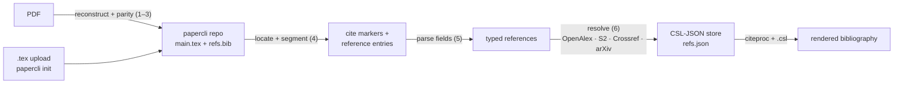

# Citation parsing

How an uploaded paper becomes normalized, CSL-JSON citations.

## The core move

Citations are not scraped out of PDF text with pattern matching. The PDF is first reconstructed into a **papercli repo** — a compilable LaTeX project in a fixed layout, under its own git repository ([paritex](https://github.com/endremborza/paritex) does the reconstruction, papercli defines the layout) — and everything downstream reads a representation that is structured by construction: in-text citations are `\cite{key}` commands, references are BibTeX entries under the same keys. A paper that arrives as source (`.tex` upload, or `papercli init` on an existing directory) skips reconstruction entirely.

## Pipeline steps

1. **Extract.** pymupdf pulls text, layout and raster images from the PDF (paritex).
2. **Reconstruct.** An AI backend writes `main.tex` + `refs.bib` into the papercli repo layout; tectonic must compile it. A structural gate rejects rounds where `refs.bib` is missing, has no entries, or lacks cited keys — a bibliography-less reconstruction cannot pass.
3. **Parity.** The rebuilt PDF is aligned word-level against the original; divergences feed back into further reconstruction rounds, and the final report is committed and shown in the UI. Reconstruction loss is measured once, up front — not discovered at export.
4. **Locate and segment.** In-text markers are the `\cite` commands (balanced-brace parsing, all `\cite*` variants); the reference list is `refs.bib`, where segmentation into entries comes free from BibTeX structure. Source uploads using inline `thebibliography` go through hallubib's free-text `\bibitem` parser instead.
5. **Parse fields.** [hallubib](https://pypi.org/project/hallubib/) parses each entry into a typed reference — structured author names, title, venue, year, DOI/arXiv ids — with LaTeX accent and unicode normalization.
6. **Resolve and normalize.** hallubib verifies each reference against OpenAlex, Semantic Scholar, Crossref and arXiv: DOI fast path, title search with year tolerance, fuzzy matching backed by a 41K journal-abbreviation database. Matched records become CSL-JSON; source-native ids are kept verbatim.

## Intermediate representation

The papercli repo is the IR — every stage is a real, compilable paper plus committed derived data:

- `main.tex` — canonical; the only thing edits ever touch.
- `refs.json` — the CSL-JSON store, keyed by cite key: the single model for every reference, whether parsed from the upload or discovered during review.
- `refs.bib` — derived: regenerated from the store for tectonic builds, never hand-maintained after import.
- `report.json` — the parity report (PDF uploads only).
- `assets/` and, for repos adopted from a real paper project, the code that generates the paper's figures and tables — preserved and versioned, never recoverable from a PDF ingest.

Each repo is a git repository; every pipeline step is a commit, milestones are tags (`parse/N`, `review/N`, `export/N`). Git is the durable state (there is no database) and also the agent interface: proposal branches and diffs need no bespoke mechanism because git is the tool coding agents are already fluent in — and a paper whose history is a commit log is a step toward reproducible research.

The server never executes anything from a repo but tectonic. Figure-generating code runs only under `papercli build`, opt-in via `[tool.papercli.build]` in the repo's own `pyproject.toml`, on a directory the user adopted locally with `papercli init` — web uploads are a single `.tex` or a PDF precisely so that untrusted code has no path to execution, and cannot produce a `pyproject.toml` to declare a build in.

## Where CSL-JSON fits

CSL-JSON is the one canonical citation model. Everything upstream converges into it — BibTeX fields, free-text entries, API records — and everything downstream renders from it through citeproc with `.csl` style files. No string templates or hand-formatted references exist anywhere in the system.

## Styles

Input side, entry style is irrelevant to parsing: resolution normalizes against API records, not formatting, so APA, IEEE, numbered and author–year entries all reduce to the same typed reference. Output side, the paper's citation style is detected from its markers and package usage (numbered vs author–year), mapped to a CSL style, user-overridable — rendering is entirely citeproc's job.

## Failures, surfaced

- Reconstruction loss: the parity report lists every diverging block; the user sees what survived verbatim before trusting any review or edit.
- Resolution: hallubib's five-status taxonomy — verified, auto-correctable, needs-attention, URL-reference, unknown — is shown as-is, most problematic first, and a network failure is distinguished from "not found online".
- Structure: dangling `\cite` keys and never-cited references are flagged in the parse view.
- Integrity: a validator diffs the cite-key multiset and the reference store before and after every change and refuses violating commits — nothing is dropped silently, by construction.
